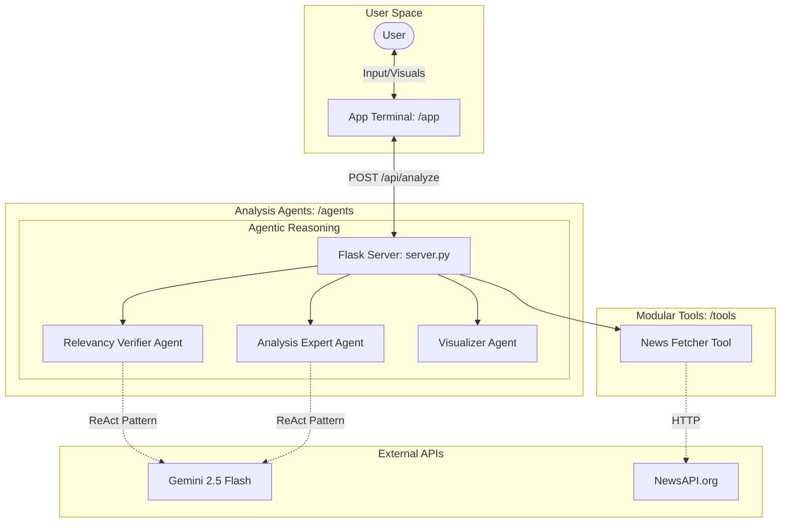

# AirSense AI

AirSense AI is a web-based, interactive terminal interface designed for analyzing air quality data. It leverages Google Gemini AI for intelligent data interpretation, Matplotlib for visualization, and NewsAPI for real-time environmental context.

## System Architecture

## Agent Profiles

AirSense AI utilizes a multi-agentic approach to ensure data accuracy and helpful insights:

1. **Relevancy Verifier Agent**: Strictly validates uploaded CSV data to ensure it contains air quality metrics. It provides an internal reasoning trace (<think> block) explaining why the data is accepted or rejected.
2. **Analysis Expert Agent**: Interprets complex pollutant levels (AQI, PM2.5, NO2, etc.) and provides health-focused, tabulated reports. It compares real-time data against WHO/EPA standards and incorporates news context for long-term outlooks.
3. **Data Visualization Agent**: Automatically detects numeric pollution patterns and generates dynamic trend charts, distribution histograms, and comparison bars using Matplotlib.

### Project Structure

- **/agents**: Core logic and backend server.
  - `server.py`: Flask-based analysis engine.
- **/tools**: MCP-style modular tools.
  - `news_tool.py`: Real-time environmental news fetcher.
- **/app**: Frontend interactive terminal.
  - `index.html`, `style.css`, `script.js`: Terminal interface and UI logic.
- `requirements.txt`: Project dependencies.
- `README.md`: Documentation and setup.

## Prerequisites

### Backend Dependencies

- Python 3.8 or higher
- Flask and Flask-CORS
- pandas
- requests
- google-genai
- matplotlib
- gunicorn (for production)

### APIs

- Google Gemini API Key (obtainable from Google AI Studio)
- NewsAPI Key (integrated in server.py)

## Installation and Setup

### 1. Backend Setup

1. Install the required Python packages:
   pip install -r requirements.txt
2. Start the Flask server:
   python agents/server.py
   The server will run on <http://localhost:5000> by default.

### 2. Frontend Setup

1. Simply open app/index.html in any modern web browser.
2. Ensure the backend server is running to use the analysis features.

## How to Use

1. Initial Setup: Type 'help' to see available commands or 'airsense' to start the analysis tool.
2. API Key: If it is your first time using the tool, you will be prompted to enter your Google Gemini API key. This key is saved in your browser's local storage for future sessions.
3. Upload Data: Select 'Upload CSV file' and choose a valid CSV containing air quality metrics (e.g., AQI, PM2.5, PM10, CO).
4. Review Results: The AI will validate the data, provide a tabulated analysis, generate trend charts, and list related environmental news.

## Features

- Interactive Terminal: A fully functional command-line interface simulation written in vanilla JavaScript.
- AI Analysis: Uses Gemini 2.5 Flash to interpret complex pollutants and provide health insights.
- Dynamic Visualizations: Automatically generates line charts, bar charts, and histograms based on the uploaded dataset.
- Real-time News: Pulls relevant air quality news to provide context for the analyzed data.
- API Key Persistence: Securely saves the user's API key in local storage and includes error handling for exhausted or invalid keys.
- Mobile Responsive: Optimized for mobile viewing

## Deployment Guide

### Frontend Deployment (Netlify)

1. Connect your GitHub repository to Netlify.
2. The `netlify.toml` automatically sets the build folder to `/app`.
3. Set your Production Backend URL in `app/script.js`.

### Backend Deployment (Render / Cloud Run)

1. Deploy the contents of the project to a platform that supports Python (like Render.com).
2. Set the Start Command to: `gunicorn agents.server:app`
3. Ensure all environment variables and dependencies in `requirements.txt` are satisfied.

## Troubleshooting

- Connection Error: Ensure the Flask server (server.py) is running on port 5000 and accessible from your browser.
- Quota Exhausted: If you receive a 429 error, the Gemini API free tier limit may have been reached. Use the 'airsense' command again to enter a new API key.
- Invalid CSV: Ensure your CSV file contains numeric data and clear headers related to air quality or pollutants.
