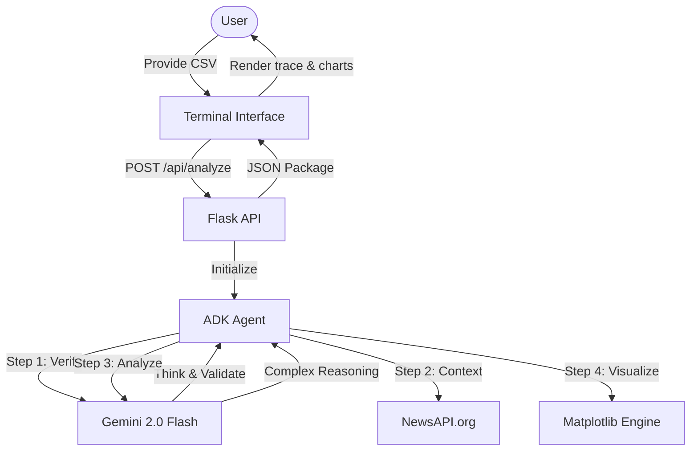

# AirSense AI

AirSense AI is a professional environment monitoring and analysis platform featuring a high-fidelity interactive terminal interface. The system provides real-time atmospheric data processing, autonomous agent reasoning, and multi-modal visualization.

## Technical Core and Frameworks

### Google Agent Development Kit (ADK)

The heart of the AirSense intelligence engine is built on the official Google Agent Development Kit (ADK) SDK. This provides a robust, code-first framework for orchestrating AI agents with a focus on reliability and transparency.

- Agent Definition: The system utilizes the `google.adk.agents.Agent` class to define a specialized environment analyst with high-context instructions.
- Orchestration: A stateful `google.adk.runners.Runner` manages the analysis workflow, ensuring precise execution of analytical tools.
- ReAct Pattern: Implementation of the "Reasoning and Acting" loop allows the AI to systematically verify or invalidate datasets, fetch external news context, and perform deep mathematical analysis before generating reports.

### Google Gemini AI

The project uses the Gemini 2.0 Flash model via the `google-genai` library. It serves as the cognitive layer for:

- Data Relevancy Verification: Strict pre-analysis checks to ensure datasets are relevant to air quality.
- Tabulated Analysis: Converting complex numeric data into precision-aligned ASCII tables.
- Predictive Modeling: Generating short-term and long-term environmental outlooks based on current trends.

### Analysis Backend

- Framework: Flask with Flask-CORS for secure API communication.
- Data Processing: Pandas for robust CSV parsing and statistical summary generation.
- Real-time Enrichment: Integration with NewsAPI to inject current global environmental context into the agent's reasoning loop.
- Visualization: Matplotlib with a custom "Matrix Green" styling engine, generating high-resolution PNGs encoded as Base64 for terminal rendering.

### Terminal Frontend

- Language: Vanilla JavaScript (ES6+) for maximum performance.
- UI Design: A custom terminal emulator with simulated typing, ASCII art banners, and responsive command-line interaction.
- PDF Generation: jsPDF integration for producing portable, professional analysis reports including full thinking logs and charts.

## System Workflow

## Key Features

- Autonomous Agent Reasoning: View the AI's internal thought process via Thinking Logs.
- High-Resolution Charts: Real-time generation of Trend Lines, Pollutant Bar Charts, and Distribution Histograms.
- Data Persistence: Persistent API key management using the Web Storage API.
- Report Export: Instant PDF generation preserving all analytical insights and visual artifacts.
- Command-Line Utility: Fully functional simulated shell environment with commands like `airsense`, `about`, `clear`, and `date`.

## Project Architecture

- /index.html: Main entry point and terminal structure.
- /style.css: Retro-futuristic aesthetic definitions and responsive grid system.
- /script.js: Core frontend engine, API handler, and terminal emulator logic.
- /server.py: Production-ready Flask server orchestrating the ADK agentic loop.
- /requirements.txt: Complete dependency manifest.

## Installation and Execution

### Prerequisites

- Python 3.8+
- Google Gemini API Key

### Backend Setup

1. Install dependencies:
   pip install -r requirements.txt
2. Start the analysis server:
   python server.py
   The backend serves at <http://localhost:5000>.

### Frontend Setup

1. Open index.html in a web browser.
2. Initialize the system by typing 'airsense' in the interactive terminal.

## Technical Narrative

AirSense AI represents a shift toward "Agentic Design Patterns" where the AI does not just respond to prompts but follows a systematic analytical ritual: observing data, verifying context, reasoning through implications, and acting by generating multi-modal outputs.
